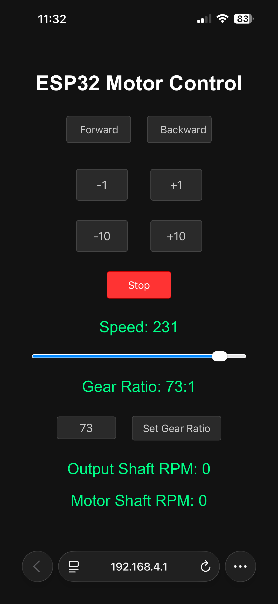

# ESP32 Motor Speed Control with L298N and IR Sensor

This project uses a motor & gears from a Microsoft Sidewinder force feedback wheels and an ESP32 to control a DC motor via an L298N H-Bridge, reads rotation speed from an IR sensor connected to a slotted wheel on the motor shaft, and serves a simple web interface to control motor direction and speed. The system accounts for an 11-slot encoder wheel and a 35:1 gearbox reduction to display the actual output shaft RPM. Additionally, it features a TFT display for real-time monitoring and an IR remote for wireless control.

## Features

- Continuous motor control (direction and speed) via web interface
- Precise position control: rotate output shaft exactly one turn clockwise or counterclockwise
- Real-time RPM display of output shaft (after gearbox reduction)
- WiFi access point for easy connection
- Real-time monitoring via TFT display (speed, gear ratio, RPM, direction)
- Wireless control using IR remote (Apple protocol) for motor direction, speed, and preset turns

## Hardware Connections

### L298N H-Bridge
- **IN1** -> ESP32 GPIO 27
- **IN2** -> ESP32 GPIO 26
- **ENA** (PWM speed control) -> ESP32 GPIO 25
- **GND** -> ESP32 GND
- **Motor power supply** -> Connect to appropriate voltage (e.g., 12V) and GND common with ESP32

### IR Sensor
- **Output** -> ESP32 GPIO 33 (with interrupt)
- **VCC** -> 3.3V or 5V (depending on sensor)
- **GND** -> GND

### Motor
- Connect motor terminals to L298N output terminals (OUT1 and OUT2)

### TFT Display
- **TFT MOSI** -> ESP32 GPIO 19
- **TFT SCLK** -> ESP32 GPIO 18
- **TFT CS** -> ESP32 GPIO 5
- **TFT DC** -> ESP32 GPIO 16
- **TFT RST** -> ESP32 GPIO 23
- **TFT BL** (backlight) -> ESP32 GPIO 4

### IR Remote
- **IR Receiver OUT** -> ESP32 GPIO 32

## Setup

1. Install the ESP32 board in Arduino IDE:
   - Go to File > Preferences
   - Add `https://raw.githubusercontent.com/espressif/arduino-esp32/gh-pages/package_esp32_index.json` to Additional Boards Manager URLs
   - Go to Tools > Board > Boards Manager, search for ESP32 and install

2. Install the required libraries:
   - TFT_eSPI (by Bodmer) - Make sure to copy the provided User_Setup.h to the TFT_eSPI library folder or modify your own to match the pins defined in the code.
   - IRremote (by Armin Joachimsmeyer)

3. Connect your ESP32 to the computer via USB.

4. Select the correct ESP32 board (e.g., "ESP32 Dev Module") and port.

5. Upload the `main.ino` sketch.

6. After uploading, open the Serial Monitor to see the IP address of the ESP32 access point.

7. Connect your computer or phone to the WiFi network:
   - SSID: `ESP32_Motor_Control`
   - Password: `12345678`

8. Open a web browser and navigate to `http://192.168.4.1` (or the IP shown in Serial Monitor).

## Usage

### Continuous Control
- Use the **Forward**, **Backward**, and **Stop** buttons to control motor direction
- Use the slider to adjust motor speed (0-255)
- The **Output Shaft RPM** display shows the actual rotational speed after the 35:1 gearbox reduction

### Precise Position Control
- Click **Rotate Clockwise 1 Turn** to rotate the output shaft exactly one turn clockwise
- Click **Rotate Counterclockwise 1 Turn** to rotate the output shaft exactly one turn counterclockwise
- During rotation, the button text changes to "Rotating..." and reverts after completion

### IR Remote Control
- Use an Apple remote to control the motor:
  - Play/Pause: Start/stop forward motion
  - Menu: Start/stop backward motion
  - Center: Stop motor
  - Volume Up: Increase speed by 1
  - Volume Down: Decrease speed by 1
  - Fast Forward (+10x): Rotate 10 turns clockwise
  - Rewind (-10x): Rotate 10 turns counterclockwise

## How It Works

- The IR sensor on the motor shaft reads the 11-slot encoder wheel
- Each rotation of the motor shaft generates 11 pulses
- With 35:1 gearbox, the output shaft rotates once for every 35 motor shaft rotations
- For precise turns: 
  - One output shaft revolution = 35 motor shaft revolutions
  - One motor shaft revolution = 11 encoder pulses
  - Therefore, one output shaft revolution = 35 × 11 = 385 encoder pulses
- The web interface shows the **output shaft RPM** after accounting for the gearbox reduction
- The TFT display shows real-time motor speed, gear ratio, output shaft RPM, motor shaft RPM, and direction
- The IR remote allows wireless control of the motor using standard Apple remote buttons

## Notes

- The IR sensor reads an 11-slot encoder wheel on the motor shaft
- The system includes a 35:1 gearbox reduction ratio in RPM calculations and position control
- The motor speed is controlled via PWM on GPIO 25. Ensure your L298N ENA pin is connected to a PWM-capable pin.
- The IR sensor uses an interrupt on GPIO 33. Make sure the sensor output is clean; we use INPUT_PULLDOWN.
- For safety, start with low motor speeds and ensure the motor is securely mounted.
- The precise turn functions run in separate FreeRTOS tasks to avoid blocking the web server
- The TFT display uses the TFT_eSPI library with custom pin configuration (see code for details)
- The IR remote uses the IRremote library and expects Apple protocol signals

## Customization

- Change WiFi credentials by modifying `ssid` and `password` variables.
- Change motor control pins by modifying `motorIN1`, `motorIN2`, and `motorPWM`.
- Change IR sensor pin by modifying `irSensorPin`.
- Change IR remote pin by modifying `IR_RECEIVE_PIN`.
- To adjust for different encoder wheels, modify `PULSES_PER_REVOLUTION` in the code.
- To adjust for different gearbox ratios, modify `GEARBOX_RATIO` in the code.
- To change TFT display pins, modify the pin definitions at the top of the code and update the User_Setup.h in the TFT_eSPI library.

## License

This project is open source and available for modification and use.

## user Interface

